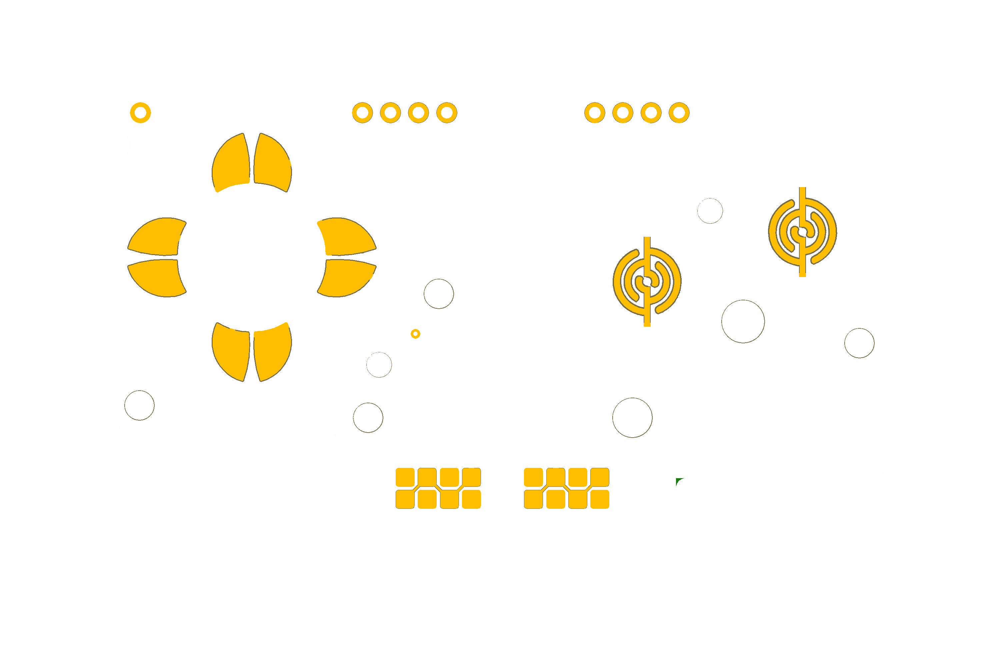
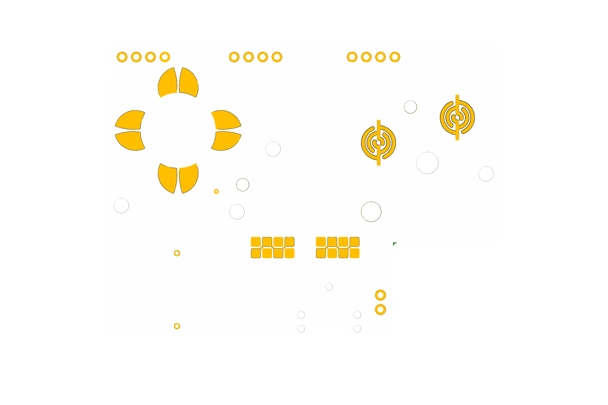
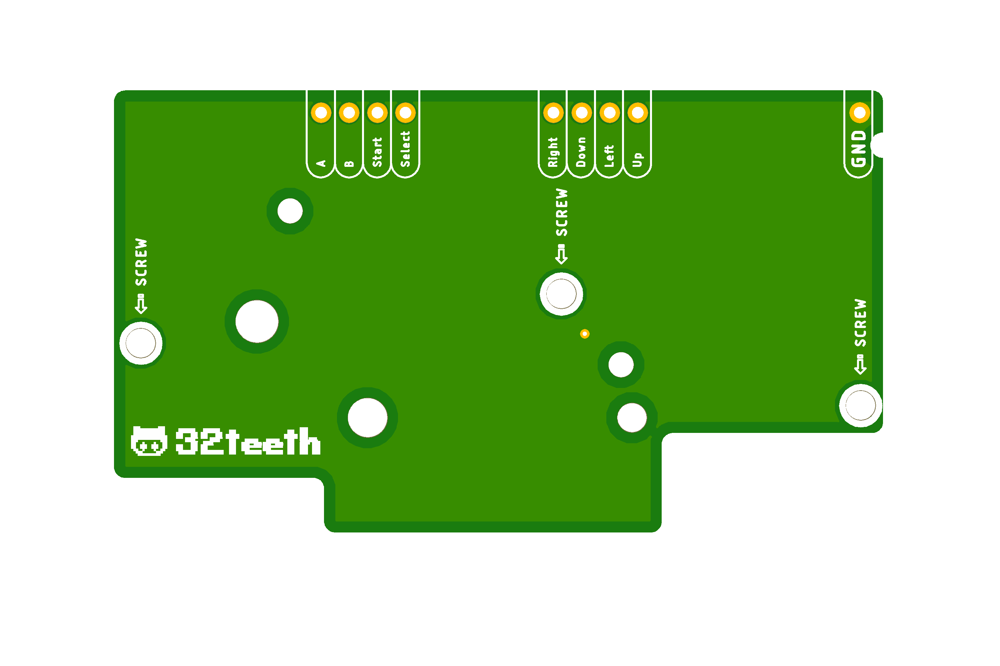
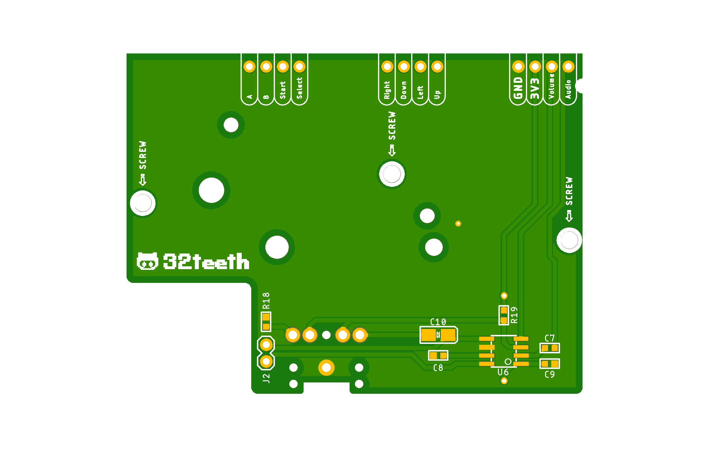

# CommonGND
These are for PERSONAL USE ONLY. Free use in any personal project.
 My logo must be kept on the boards and on any boards adapted with them and full credit must be given. AKA read the licence (https://creativecommons.org/licenses/by-nc-sa/3.0/)
 Enjoy :)

## New Gameboy Pocket IO Boards
> Contribution Added by [@32teeth](https://github.com/32teeth) from [@retro-esp32](https://github.com/retro-esp32)

See [Licence](LICENCE.md) and [Code of Conduct](CODE_OF_CONDUCT.md)

| |W/O Audio | Audio |
|-|-|-|
|Top | | |
|Bottom | | |